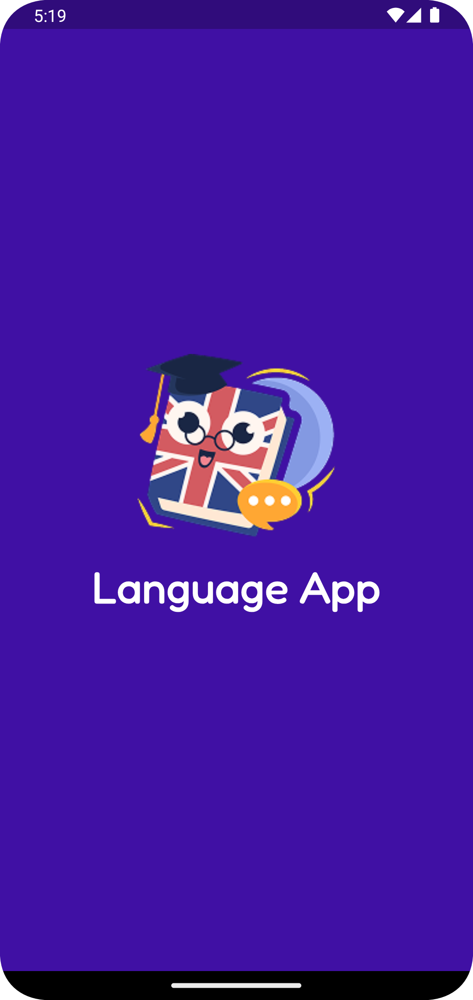
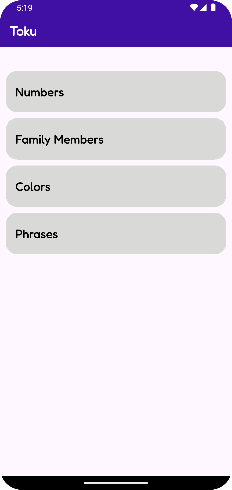
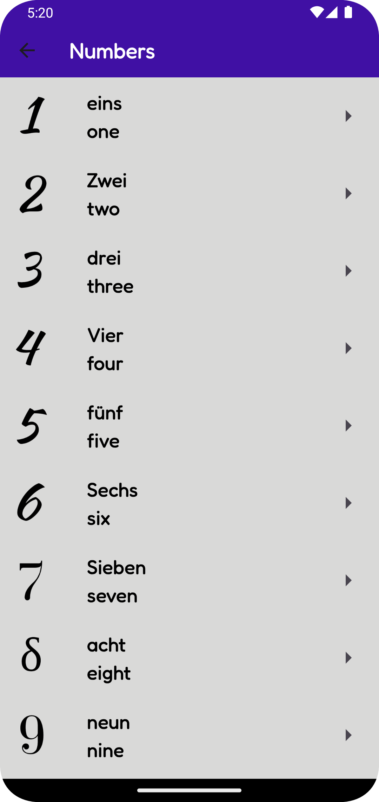
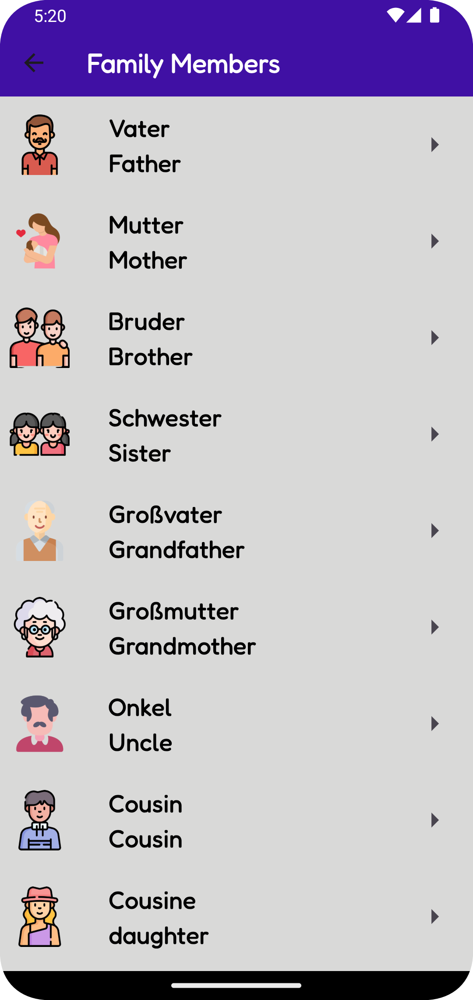
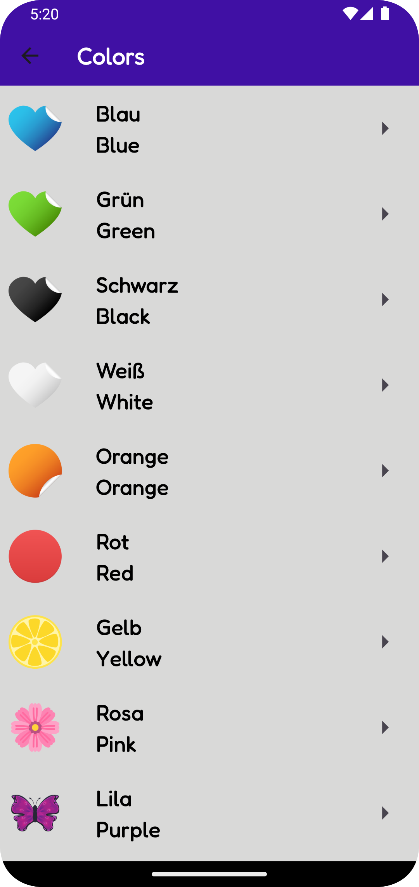

A Flutter-based educational app that teaches German numbers and words with visual representations. It includes audio pronunciation to enhance learning.

## 📸 Screenshots

📌 Technologies Used in the Project:
Flutter - The main framework for the application.
Dart - The programming language used with Flutter.
Audioplayers – For playing audio files.
Flutter Assets – For storing images and audio files within the app.
Flutter Widgets – Such as Image for displaying images and Text for displaying text.
Material Design – For designing the user interface.